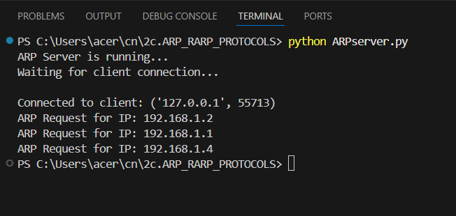
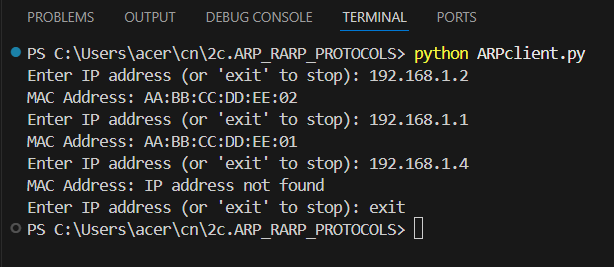
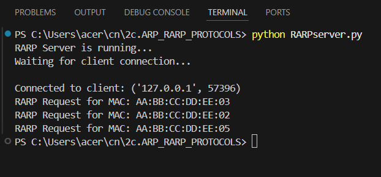
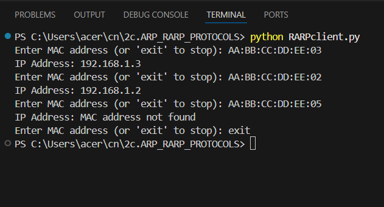

# 2c.SIMULATING ARP /RARP PROTOCOLS
## AIM
To write a python program for simulating ARP protocols using TCP.
## ALGORITHM:
## Client:
1. Start the program
2. Using socket connection is established between client and server.
3. Get the IP address to be converted into MAC address.
4. Send this IP address to server.
5. Server returns the MAC address to client.
## Server:
1. Start the program
2. Accept the socket which is created by the client.
3. Server maintains the table in which IP and corresponding MAC addresses are
stored.
4. Read the IP address which is send by the client.
5. Map the IP address with its MAC address and return the MAC address to client.
P
## PROGRAM - ARP
## server.py:
```
import socket
server = socket.socket(socket.AF_INET, socket.SOCK_STREAM)
server.bind(('localhost', 8080))
server.listen(1)

print("ARP Server is running...")
print("Waiting for client connection...\n")

conn, addr = server.accept()
print("Connected to client:", addr)
arp_table = {
    "192.168.1.1": "AA:BB:CC:DD:EE:01",
    "192.168.1.2": "AA:BB:CC:DD:EE:02",
    "192.168.1.3": "AA:BB:CC:DD:EE:03"
}

while True:
    ip = conn.recv(1024).decode()
    if not ip:
        break

    print("ARP Request for IP:", ip)

    mac = arp_table.get(ip, "IP address not found")
    conn.send(mac.encode())

conn.close()
server.close()
```
## client.py:
```
import socket
client = socket.socket(socket.AF_INET, socket.SOCK_STREAM)
client.connect(('localhost', 8080))

while True:
    ip = input("Enter IP address (or 'exit' to stop): ")

    if ip.lower() == "exit":
        break

    client.send(ip.encode())
    mac = client.recv(1024).decode()
    print("MAC Address:", mac)

client.close()
```
## OUPUT - ARP
## SERVER:

## CLIENT:


## PROGRAM - RARP
## server.py:
```
import socket

server = socket.socket(socket.AF_INET, socket.SOCK_STREAM)
server.bind(('localhost', 9090))
server.listen(1)

print("RARP Server is running...")
print("Waiting for client connection...\n")

conn, addr = server.accept()
print("Connected to client:", addr)

rarp_table = {
    "AA:BB:CC:DD:EE:01": "192.168.1.1",
    "AA:BB:CC:DD:EE:02": "192.168.1.2",
    "AA:BB:CC:DD:EE:03": "192.168.1.3"
}

while True:
    mac = conn.recv(1024).decode()
    if not mac:
        break

    print("RARP Request for MAC:", mac)

    ip = rarp_table.get(mac, "MAC address not found")
    conn.send(ip.encode())

conn.close()
server.close()
```
## client.py:
```
import socket

client = socket.socket(socket.AF_INET, socket.SOCK_STREAM)
client.connect(('localhost', 9090))

while True:
    mac = input("Enter MAC address (or 'exit' to stop): ")

    if mac.lower() == "exit":
        break

    client.send(mac.encode())
    ip = client.recv(1024).decode()
    print("IP Address:", ip)

client.close()
```

## OUPUT -RARP
## SERVER:

## CLIENT:

## RESULT
Thus, the python program for simulating ARP protocols using TCP was successfully 
executed.
